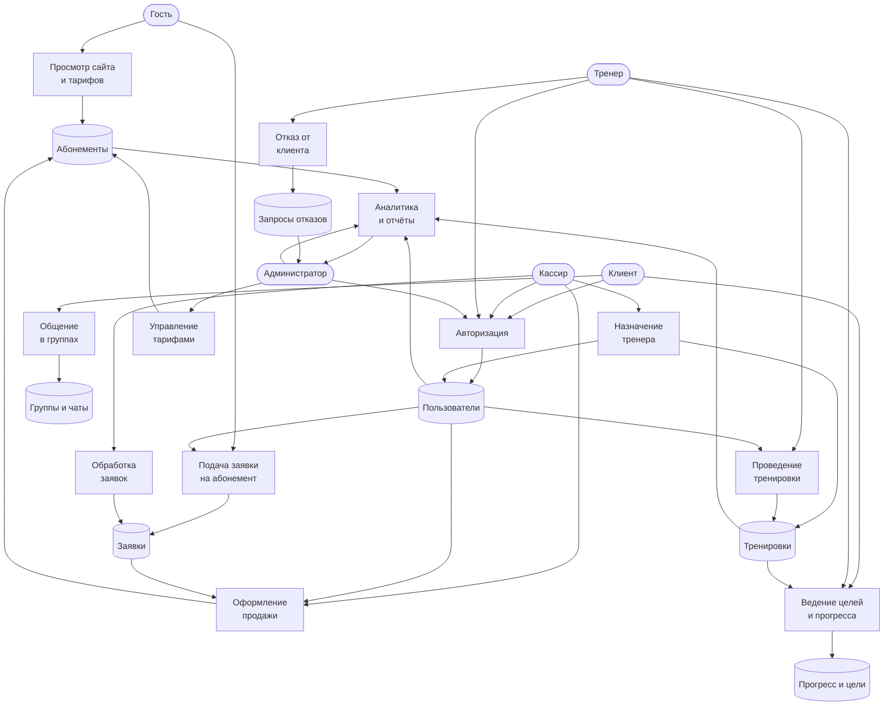
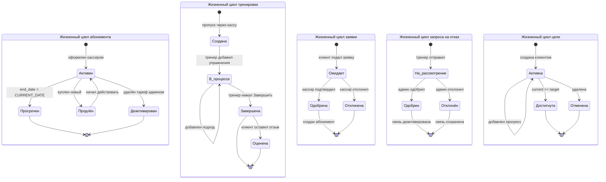
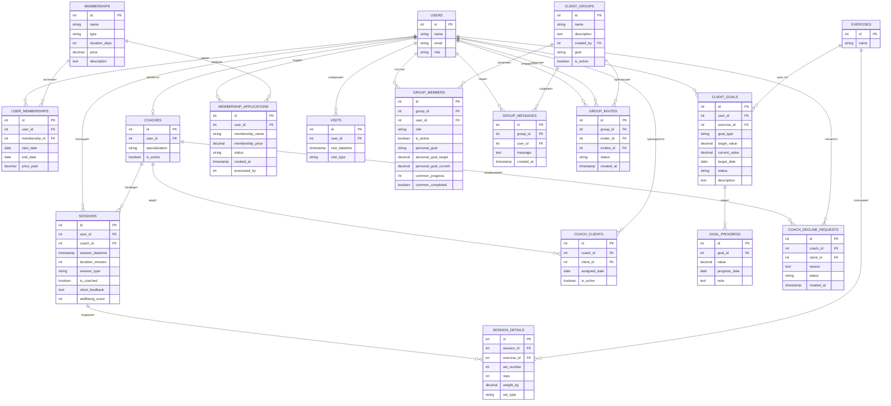

# Fitness Club — Система управления фитнес-клубом

Веб-приложение для комплексной автоматизации работы фитнес-клуба на стеке FastAPI + PostgreSQL с фронтендом на чистом HTML, CSS и JavaScript.

---

##  О проекте

Fitness Club охватывает полный цикл взаимодействия с клиентом: от первого знакомства с сайтом и заявки на абонемент до проведения тренировок, отслеживания прогресса и общения в группах. Приложение построено на стеке FastAPI + PostgreSQL с фронтендом на чистом HTML, CSS и JavaScript, и разделено на пять ролей с разным уровнем доступа — от гостя сайта до администратора клуба.

---

##  Бизнес-требования

### Управление пользователями и ролями

Система поддерживает пять типов пользователей, каждый из которых видит только свою часть функциональности. Гость — это неавторизованный посетитель сайта, который может изучить информацию о клубе, посмотреть тарифы и тренеров, а также оставить заявку на абонемент. Клиент — зарегистрированный пользователь с действующим абонементом, которому доступны личный кабинет, прогресс, цели, группы и отзывы. Тренер работает со своими клиентами: ведёт тренировки, ставит цели, отслеживает прогресс подопечных и оставляет отзывы. Кассир отвечает за фронт-офис: регистрирует новых клиентов, оформляет продажи абонементов, назначает тренеров и контролирует проход клиентов через пропускную систему. Администратор управляет тарифами и тренерами, видит общую аналитику клуба и обрабатывает спорные ситуации, например запросы тренеров на отказ от клиентов.

Особенностью системы является упрощённая авторизация: пользователь входит по своему ФИО и ID, где ID одновременно служит паролем. Такой подход выбран для внутренней системы, где нет публичной регистрации, и все пользователи создаются сотрудниками клуба.

### Управление абонементами

Администратор формирует каталог тарифов, указывая название, тип, длительность в днях, стоимость и описание. Тарифы отображаются на главной странице сайта и доступны для оформления через кассира. Когда клиент приобретает абонемент, система проверяет наличие активного абонемента у него: если такой есть, старый деактивируется, а новый начинает действовать с текущей даты. Активным считается абонемент, у которого дата окончания больше или равна текущей дате. Клиент в личном кабинете видит название своего тарифа, дату начала и окончания, стоимость и количество оставшихся дней.

Отдельного внимания заслуживает механизм публичных заявок. Посетитель сайта может оставить заявку, указав своё имя или email и выбранный тариф. Система ищет клиента в базе и создаёт заявку со статусом «в ожидании». Кассир в своём интерфейсе видит очередь таких заявок и может одобрить её — тогда клиенту автоматически создаётся абонемент — или отклонить. При этом действуют два ограничения: клиент не может подать заявку, если у него уже есть активный абонемент, и не может создать вторую заявку, пока первая не обработана.

### Управление тренерами

Администратор регистрирует тренеров, указывая их ФИО, email и специализацию. Каждый тренер получает в системе учётную запись с ролью trainer и запись в таблице coaches. При необходимости администратор может выдать тренеру бесплатный абонемент для собственных тренировок. Кассир при продаже абонемента может сразу назначить клиенту тренера, либо сделать это позже через отдельную форму. Здесь действует важное бизнес-правило: у одного тренера не может быть больше тридцати активных клиентов. Проверка лимита выполняется как при назначении через кассира, так и при продаже абонемента с тренером.

### Проведение тренировок и пропускная система

Работа с тренировками начинается в момент, когда клиент приходит в клуб. Кассир через пропускную систему отмечает его приход, и система автоматически создаёт запись о тренировке, привязывая её к тренеру клиента. Если тренер не назначен, система подставляет первого доступного тренера, чтобы запись не осталась без ответственного.

Тренер в своём кабинете видит список активных тренировок и может открыть любую из них. В процессе тренировки он добавляет упражнения, а для каждого упражнения — подходы с указанием повторений и веса. Данные сохраняются в базу. Когда тренер завершает тренировку, она помечается как завершённая и попадает в историю клиента. Незавершённая тренировка в прогрессе не учитывается.

### Прогресс и цели

Прогресс клиента формируется автоматически на основе завершённых тренировок. Система агрегирует данные по каждому упражнению: максимальный вес, максимальное количество повторений, общее число подходов и дату тренировки. Клиент и его тренер видят эту динамику в виде таблицы с процентным ростом относительно первого результата. Для удобства доступен выбор упражнения из списка тех, по которым у клиента есть данные.

Цели — это отдельная сущность, которую может создавать как клиент, так и тренер для себя. Цель содержит упражнение, тип измерения (вес, повторения или время), целевое значение, дату достижения и описание. По мере обновления прогресса система сравнивает текущее значение с целевым и при достижении автоматически меняет статус цели на «достигнута».

### Отзывы

Отзывы о тренировках оставляют две категории пользователей. Клиент может оценить прошедшую тренировку по пятибалльной шкале и написать текстовый комментарий. Тренер, который сам занимается в клубе как клиент, тоже может оставлять отзывы о своих тренировках. Тренер видит все отзывы — и свои, и своих клиентов — с возможностью фильтрации по источнику.

### Группы и социальные активности

Группы — это социальная надстройка над основным функционалом. Любой клиент может создать группу, указав название, общую цель и описание. Создатель автоматически становится администратором группы. Администратор приглашает других пользователей по имени или email, и приглашённый может принять или отклонить приглашение.

Внутри группы есть три ключевых элемента. Первый — чат с автообновлением каждые пять секунд, где участники обмениваются сообщениями. Второй — общая цель группы, по которой каждый участник ведёт свой прогресс. Третий — личные цели участников, у каждой свой прогресс и статус. Администратор группы может исключать участников, а любой участник может покинуть группу по собственному желанию.

### Отказ тренера от клиента

Бывают ситуации, когда тренер по каким-то причинам не может продолжать работу с клиентом. Для этого предусмотрен механизм запроса на отказ. Тренер отправляет запрос с указанием причины, и он попадает в очередь к администратору. Администратор может одобрить запрос — тогда связь между тренером и клиентом деактивируется, и клиент переходит в общий пул — либо отклонить, и тогда связь сохраняется. Повторный запрос по тому же клиенту невозможен, пока предыдущий не обработан.

### Аналитика для администратора

Администратор видит ключевые показатели клуба: общую выручку за всё время, динамику доходов с разбивкой по дням, месяцам и годам, количество активных абонементов, число тренеров и клиентов. Отдельно доступны списки активных клиентов и запросов на отказ. Динамика доходов отображается в виде интерактивного графика, который агрегирует данные из двух источников — прямых продаж и активаций через заявки.

---

## Сценарии использования

**Кассир** регистрирует нового клиента, когда тот приходит в клуб впервые, оформляет продажу абонемента с возможностью сразу назначить тренера, контролирует вход через пропускную систему и обрабатывает заявки, поступившие с сайта.

**Тренер** открывает свой кабинет, чтобы увидеть список клиентов с группировкой по статусу абонемента — активные, просроченные и без абонемента. Ведёт тренировку пошагово, фиксируя упражнения и подходы. Ставит личные цели и отслеживает их достижение. Просматривает отзывы клиентов, чтобы понимать качество своей работы.

**Клиент** заходит в личный кабинет, чтобы проверить состояние абонемента и остаток дней, посмотреть прогресс по упражнениям, обновить цели, пообщаться с другими клиентами в группах и оставить отзыв о прошедшей тренировке.

**Администратор** отслеживает общую статистику клуба, управляет тарифами и тренерами, разбирает запросы на отказ от клиентов.

---

## Диаграммы

### DFD — Диаграмма потоков данных

Показывает движение данных между внешними сущностями, процессами и хранилищами.

### STD — Диаграмма состояний

Описывает жизненные циклы ключевых сущностей системы.

### ER — Структура базы данных

Схема связей между таблицами PostgreSQL.

